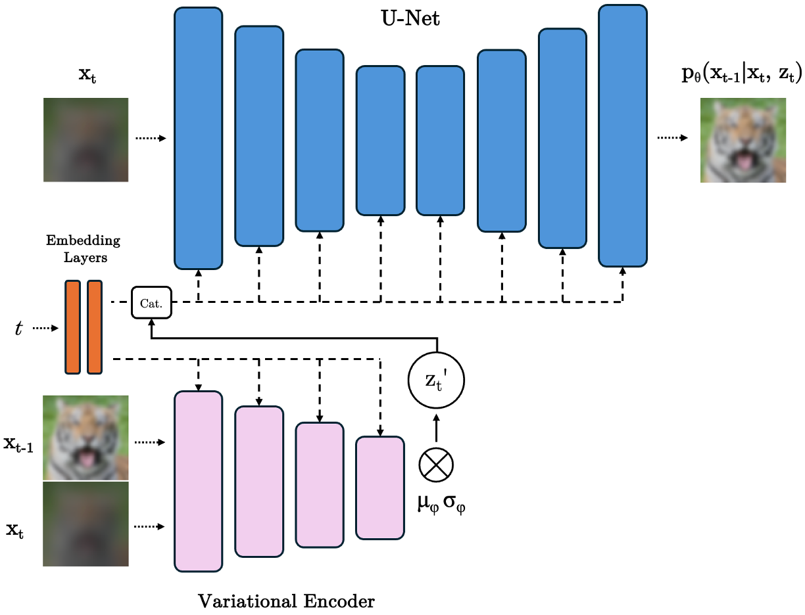
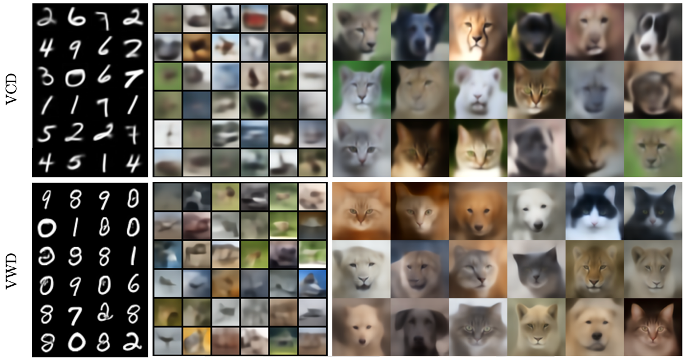
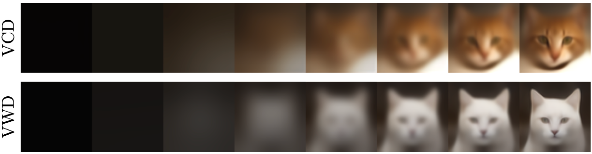
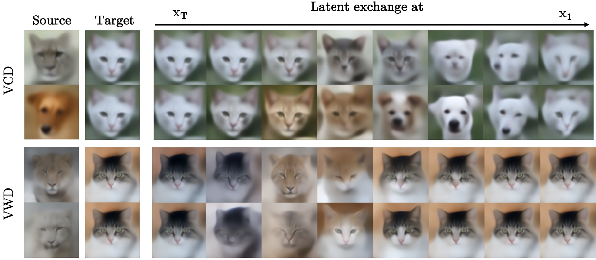

# Variational Cold Diffusion

We present Variational Cold Diffusion (VCD), a framework for diffusion-like systems that couple a deterministic degradation operator and a variational encoder to guide the reconstruction process. VCD separates the entropy of the forward and the reverse process, allowing for full generative control via the variational encoder. We demonstrate the benefits of this approach by exploiting the inductive bias of blurring degradation, which gives rise to an image generation process that iteratively adds low- to high-frequency image features. We find that data-level perturbation during training is essential to sample deterministic diffusion models sequentially, and propose two methods to achieve this: incorporating the model’s own bias into training and using minimal noise injections for perturbation. Our work contributes to understanding the dynamics in (deterministic) diffusion models and the role of Gaussian perturbation therein, and provides a general framework for controlling the inductive biases of arbitrary deterministic degradation operators.

## Code Structure

Classes for the Diffusion Forward and Reverse processes and for training and sampling are defined in [diffusion.py](/scripts/diffusion.py). This includes degradation operators, schedules, reconstruction operations, the trainer class and the sampler class. The model setup defined in the config files is run in [main.py](/main.py). Figures other than unconditional generations are created with [experiments.ipynb](/experiments.ipynb).

## Usage

Default model values are defined in [configs](/configs/) for each of the three datasets, and is a required argument when running [main.py](/main.py). Without additional arguments, running [main.py](/main.py) with a config file trains a diffusion model without a variational encoder using sequential xt prediction. A variational encoder can be added via the ```--vae``` flag. VCD perturbation can be added via the  ```--vcd``` flag, VWD perturbation via the  ```--vwd``` flag. As an example, VWD for AFHQ can be trained via:

 ```python main.py --config config/afhq.txt --vae --vwd``` 

#### Overriding configs

All arguments defined in the configs can be overridden by definining them in the terminal as additional arguments. As an example, training a model for x0 prediction instead of xt prediction can be achieved via:

 ```python main.py --config config/afhq.txt --prediction x0 --vae --vwd``` 

 Alternatively, the values in the config files can be changed.

#### Baseline models

When the baseline argument is one of "ddpm", "risannen", or "bansal", all relevant args are overridden to train a model according to the baseline type. Note that the degradation operator is not overridden, to allow for testing the baseline approaches for different degradation types. The [Rissannen et al., (2023)](/main.py) baseline for CIFAR-10 using a blacking + blurring degradation can be run via: 

 ```python main.py --config config/cifar10.txt --baseline risannen --degradation black_blur``` 

#### Adding arbitrary degradation operators

Currently, Variational Cold Diffusion supports noising, blurring, blacking + blurring, pixelation, and blacking + pixelation as degradation operators. If needed, new degradation operators can be added as a method to the Degradation class in [diffusion.py](/scripts/diffusion.py), which receives some original data x0 and a timestep t. After adding a new degradation method, an extra elif statement needs to be added to the degrade method in line 346 and the assert statement in line 135 needs to be adjusted. 


## Architecture

VCD consists of a classic U-Net (Ronneberger et al., 2015) with a encoder-decoder structure as the diffusion model, or generator, and a second, variational encoder. The variational encoder has the same architecture as the regular U-Net encoder part, with the depth of feature maps decreased by a factor of 2 for parameter efficiency. During training, xt is used as an input to the U-Net to predict the less degraded latent xt−1. The variational encoder receives both xt and xt−1 and encodes the information to accurately predict xt−1 from xt by parameterizing a multivariate Gaussian by its means μφ and variances σφ. The resulting sampled latent zt is then used as a conditioning signal to the U-Net, together with the diffusion step embedding t. A schematic illustration of the VCD architecture is given in Figure 3. All variational models were trained using the same architecture, only differing in their parameter settings. Non-variational models for baselines were trained using only the U-Net structure, without the variational encoder.

<p align="center">
  
</p>

## Unconditional Samples

Unconditional samples for VCD and VWD on MNIST, CIFAR-10, and AFHQ. Both VWD and VCD generate meaningful samples for all datasets, although below the perceptual quality of standard denoising diffusion. VWD samples are of slightly higher quality than VCD samples, which is also reflected in lower FID scores (for AFHQ: FID 96.79 (VWD) vs. 108.16 (VCD)) 




## Generative Sequences 

Generative sequences for VCD and VWD, showing the intended inductive bias of iteratively adding low- to high frequency image features.



## Generative Control

The generative process can be controlled through the variational latents used at every reconstruction step. We investigate the impact of this generative control by exchanging the latents used to generate a target image with those of a source image at different reconstruction steps, similar to the procedure described in Karras et al. (2019) for decoder layers instead of diffusion steps. Latent exchanges early on in the generation process should transfer low-frequency information from the source towards the target, exchanges higher up the generative trajectory should impact mid- and high-frequency features.



