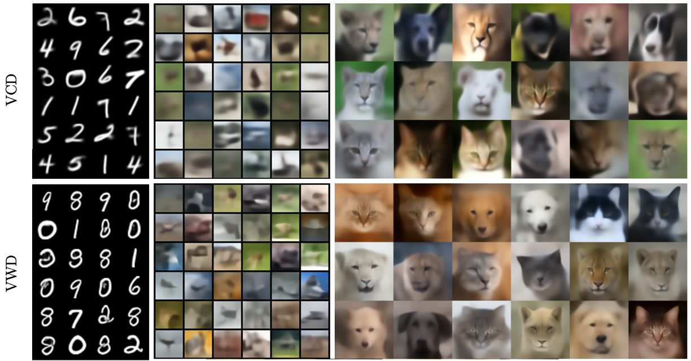
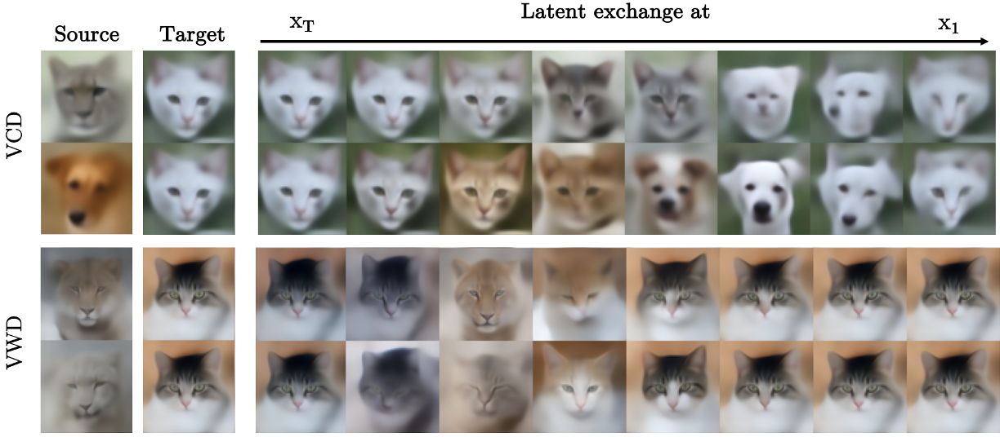
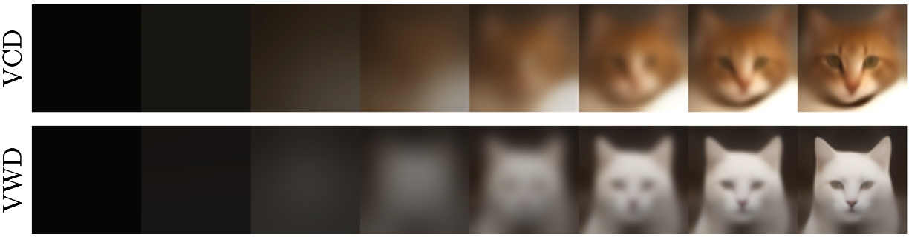

# VariationalColdDiffusion

We present Variational Cold Diffusion (VCD), a framework for diffusion-like systems that couple a deterministic degradation opera- tor and a variational encoder to guide the reconstruction process. VCD separates the entropy of the forward and the reverse process, allowing for full generative control via the variational encoder. We demonstrate the benefits of this approach by exploiting the inductive bias of blurring degradation, which gives rise to an image generation process that iteratively adds low- to high-frequency image features. We find that data- level perturbation during training is essential to sample deterministic diffusion models sequentially, and propose two methods to achieve this: incorporating the model’s own bias into training and using minimal noise injections for perturbation. Our work contributes to understanding the dynamics in (deterministic) diffusion models and the role of Gaussian perturbation therein, and provides a general framework for controlling the inductive biases of arbitrary deterministic degradation operators.

## Architecture

VCD consists of a classic U-Net (Ronneberger et al., 2015) with a encoder-decoder structure as the diffusion model, or generator, and a second, variational encoder. The variational encoder has the same architecture as the regular U-Net encoder part, with the depth of feature maps decreased by a factor of 2 for parameter efficiency. During training, xt is used as an input to the U-Net to predict the less degraded latent xt−1. The variational encoder receives both xt and xt−1 and encodes the information to accurately predict xt−1 from xt by parameterizing a multivariate Gaussian by its means μφ and variances σφ. The resulting sampled latent zt is then used as a conditioning signal to the U-Net, together with the diffusion step embedding t. A schematic illustration of the VCD architecture is given in Figure 3. All variational mod- els were trained using the same architecture, only differing in their parameter settings.Non-variational models for baselines were trained using only the U-Net structure, without the variational encoder. Model dimension in 2 refers to the base dimension, which is multiplied in deeper feature maps.

## Unconditional Samples

Unconditional samples for VCD and VWD on MNIST, CIFAR-10, and AFHQ.

## Generative Sequences 

Generative sequences for VCD and VWD, showing the intended inductive bias of iteratively adding low- to high frequency image features.

# Generative Control

The generative process can be controlled through the variational latents used at every reconstruction step. We investigate the impact of this generative control by exchanging the latents used to generate a target image with those of a source im- age at different reconstruction steps, similar to the procedure described in Karras et al. (2019) for decoder layers instead of diffusion steps. Latent exchanges early on in the generation process should transfer low-frequency information from the source towards the target, exchanges higher up the generative trajectory should impact mid- and high-frequency features.

